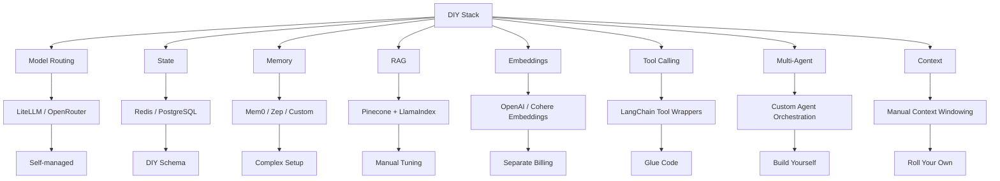
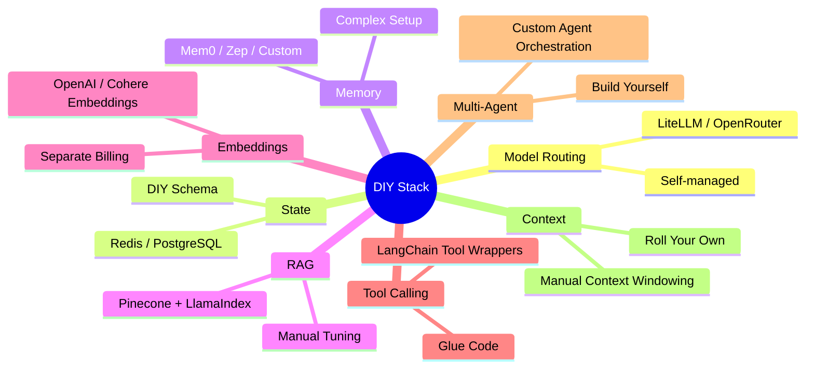

# IDP Stack (Independent Development Platform Stack) | Agentic Software Factory

- Data sovereignty vs data residency vs data localisation - https://www.macquariedatacentres.com/blog/a-guide-to-australian-data-centre-sovereignty/

1. Windows Desktop Machine with all developer tools - Done
2. Linux Desktop Machine with all developer tools with (Agent Harness.) - Done
4. Docker Container Server - Done
5. Local GITHUB repo - done
6. Key Management
7. Ubuntu AI Server with AI Tools for Nvidia
8. https://github.com/uber/ADR
Hermes Agent OS
https://github.com/block/buzz
https://engineering.block.xyz/blog/run-your-own-buzz-relay
Obsidian

# Python

- https://docs.astral.sh/ruff/
- https://mypy-lang.org/
- https://docs.pytest.org/en/stable/
- https://pre-commit.com/
- https://github.com/sqlalchemy/alembic
- https://www.sqlalchemy.org/

# AI Development & Self-Hosted Platform Stack

| Category | Project | Description | URL |
|----------|----------|-------------|-----|
| **Workstation** | Windows | Workstation | Link |
| | Linux| Workstation | Link |
| **Autonomous Coding** | OpenHands | Full autonomous coding harness | https://github.com/All-Hands-AI/OpenHands |
| | Aider | Git-native AI coding assistant | https://github.com/Aider-AI/aider |
| | Continue | IDE-integrated local AI coding assistant | https://continue.dev |
| | Cline | VS Code autonomous coding agent | https://github.com/cline/cline |
| | OpenCode | Terminal-native AI coding | https://github.com/opencode-ai/opencode |
| | SWE-agent | Autonomous software engineering benchmark | https://github.com/SWE-agent/SWE-agent |
| | OpenDevin | Early autonomous coding platform | https://github.com/OpenDevin/OpenDevin |
| | OpenClaw | Autonomous coding & agent framework | https://github.com/OpenClaw/OpenClaw |
| | Turnstone | Self-hosted local-first AI orchestration | https://github.com/turnstonelabs/turnstone |
| | PA AI | AI coding platform | |
| | Hermes Agent | Autonomous AI agent | |
| | DeepSeek UI | DeepSeek interface | |
| **Agent Frameworks** | Microsoft AutoGen | Multi-agent orchestration | https://github.com/microsoft/autogen |
| | Microsoft Agent Framework | Enterprise agent platform | https://github.com/microsoft/agent-framework |
| | PydanticAI | Structured AI agents | https://ai.pydantic.dev |
| | LangGraph | Stateful AI workflows | https://langchain-ai.github.io/langgraph |
| | ZooCode | AI agent framework | https://docs.zoocode.dev |
| | Mesh LLM | Distributed LLM orchestration | https://github.com/Mesh-LLM/mesh-llm |
| | OmniGent | General AI agent framework | https://omnigent.ai/quickstart/install |
| | Terax-AI | Autonomous agent platform | |
| | Odysseus | Autonomous agent framework | https://github.com/pewdiepie-archdaemon/odysseus |
| | Push | Autonomous agent framework | https://github.com/owainlewis/push |
| | Open Chat | Autonomous agent framework| Open chat platform | 
| | Nemo | Autonomous agent framework | https://github.com/NVIDIA-NeMo/labs-OO-Agents| 
| | Machinest | Machinest | https://github.com/owainlewis/machinist | 
| OpenWorker |https://github.com/andrewyng/openworker|
| **AI Routing & Gateways** | OmniRoute | Multi-provider routing | https://github.com/diegosouzapw/OmniRoute |
| | OmniRoute Online | Hosted routing platform | https://omniroute.online |
| | OpenRouter | Multi-model gateway | https://openrouter.ai |
| | SG Lang | LLM serving framework | https://github.com/sgl-project/sglang |
| | vLLM | High-performance LLM serving | https://github.com/vllm-project/vllm |
||https://github.com/andrewyng/openworker|
| Lemonade ||https://lemonade-server.ai/|
| **Workflow Automation** | n8n | Workflow automation | https://n8n.io |
| | Flowise | Visual AI workflows | https://flowiseai.com |
| | Dify | LLM application platform | https://dify.ai |
| | Worklenz | Project management | https://worklenz.com |
| | Multica | Multi-agent orchestration | https://multica.ai |
| | Herdr | AI workflow platform | https://herdr.dev |
| **Durable Execution** | Temporal | Durable workflows | https://temporal.io |
| | DBOS | Durable backend execution | https://dbos.dev |
| | Inngest | Event-driven durable functions | https://inngest.com |
| **LLM Platforms** | Ollama | Local LLM runtime | https://ollama.com |
| | Open WebUI | Local ChatGPT interface | https://openwebui.com |
| | DeepSeek | Open LLM platform | https://deepseek.com |
| **Knowledge & Memory** | Mem0 | Long-term AI memory | https://mem0.ai |
| | Zep | AI memory platform | https://www.getzep.com |
| | Graphiti | Knowledge graph memory | https://github.com/getzep/graphiti |
| | Khoj | Personal AI knowledge assistant | https://khoj.dev |
| | AppFlowy | Self-hosted workspace | https://appflowy.io |
| | Obsidian | Knowledge management | https://obsidian.md |
| | Read the Docs | Documentation platform | https://readthedocs.org |
| | Wiki | Internal documentation | |
| | Plane | Internal documentation | |
| **Prompt Engineering** | Headroom | Prompt optimisation | |
| | Caveman | Prompt engineering | |
| **Development** | Jupyter Notebook | Interactive development | https://jupyter.org |
| | GitLab | Source control | https://gitlab.com |
| | Forgejo | Self-hosted Git platform | https://forgejo.org |
| **Project Management** | Plane | Open-source project management | https://plane.so |
| | Huly | Collaboration platform | https://huly.io |
| | OpenProject | Project management | https://www.openproject.org |
| **Infrastructure** | Proxmox VE | Virtualisation platform | https://www.proxmox.com |
| | LocalStack | Local AWS cloud emulation | https://localstack.cloud |
| | OpenDevStack | Kubernetes DevOps platform | https://www.opendevstack.org |
| | S3 Storage | Object storage | |
| Mini Stack |  Local AWS cloud emulation | https://ministack.org/ | |
| **Remote Access** | Apache Guacamole | Remote desktop gateway | https://guacamole.apache.org |
| | NoMachine NX | Remote desktop | https://www.nomachine.com |
| | Tailscale | Secure mesh VPN | https://tailscale.com |
| **Operating Systems** | Omarchy / Windows 11 SOE | Desktop operating systems | |
| **Observability** | OpenObserve | Logs & observability | https://openobserve.ai |
| **Vector Database** | Qdrant | Vector database | https://qdrant.tech |
| Weaviate | Vector database | https://weaviate.io/ |
| Pinecone | Vector database | https://www.pinecone.io/ |
| **Testing** | Playwright | Browser automation testing | https://playwright.dev |
| **Code Quality** | SonarQube | Static analysis | https://www.sonarsource.com/products/sonarqube |
| **Hosting** | cPanel | Hosting control panel | https://cpanel.net |
| | LAMP Stack | Linux/Apache/MySQL/PHP | |
| | NGINX | Web server | https://nginx.org |
| | Joomla | CMS | https://www.joomla.org |
| **Compression & Optimisation** | Unsloth | LLM fine-tuning & quantisation | https://unsloth.ai |
| | PrismML | Model compression | https://prismml.com |
| **AI Research** | Apple Foundation Models | Apple on-device foundation models | https://machinelearning.apple.com/research/introducing-third-generation-of-apple-foundation-models |
| **Desktop AI** | MSTY Claw | Local AI desktop | https://msty.ai/claw |
| | DiffusionBee | Stable Diffusion desktop | https://diffusionbee.com |
| **Business AI** | BridgeMind | Enterprise AI platform | https://www.bridgemind.ai |
| | Pi | Personal AI assistant | https://pi.ai |
| | CMUX | AI platform | https://cmux.com |
| **CRM & Support** | Twenty CRM | Open-source CRM | https://twenty.com |
| | Chatwoot | Customer support platform | https://www.chatwoot.com |
| **Evulation and Correctness** | DeepEval |  Eval | https://deepeval.com/ |
| **Can Run IT ** |  Can Run It|  Eval | https://deepeval.com/ |
| | Canirun | Can Run It| https://www.canirun.ai/device/m5-pro?use=code |
| | LimFIT | Can Run It| https://www.llmfit.org/ |
| **AgentProxyn** | AgentGateway| Proxy | https://agentgateway.dev/ |
| | Super Simple Software Factory | Can Run It| https://github.com/disler/super-simple-software-factory |
| | Super Simple Software Factory | Can Run It| https://github.com/Loxstomper/software-factory https://lochieashcroft.com/talks/autonomous-factory/#/5 |
| | NEO | Can Run It| https://github.com/owainlewis/neo |

- colibri - https://github.com/JustVugg/colibri


- Compute
-     Omrach/W11 SOE
-     Guacamole / NX Server / TailScale
- Memmory
-     Wiki
-     Read the Docs
-     https://www.getzep.com/
-     https://mem0.ai/
-     https://github.com/getzep/graphiti
- Prompt Optimization
-     Headroom
-     Caveman
- Kanbam
-      https://multica.ai/
- Automation
-     Worklenz
-     Obsidian
-     JupiterNotebook
-     N8n
-     OpenRouter, Open Chat, SG Lang and vLLM
- Code Repo
-     GitLabh ttps://forgejo.org/
-     https://github.com/makeplane/plane
-     Huly
- Platform
-     S3
-     https://www.openproject.org/
-     Proxmox
-     LocalStack - https://chatgpt.com/c/6a0a91ec-03b4-83ec-ad9d-c1c2f25ec546
-     https://www.opendevstack.org/
- Code Quality
-     SonarCube
- Testing
-     Playwright
- Hosting
-     CPANEL
-     LAMP/NGNIX/Joomla
- Quantisation and Compresion
-     Unsolth
-     https://prismml.com/
- Agent
-     https://docs.zoocode.dev/

- n8n: https://n8n.io
- Open WebUI: https://openwebui.com
- Ollama: https://ollama.com
- Flowise: https://flowiseai.com
- Dify: https://dify.ai
- Chatwoot: https://www.chatwoot.com
- AppFlowy: https://appflowy.io
- Khoj: https://khoj.dev
- Twenty CRM: https://twenty.com
- Plane: https://plane.so
- OpenObserve: https://openobserve.ai
- Qdrant: https://qdrant.tech


| Project                                                                              | Best For                            |
| ------------------------------------------------------------------------------------ | ----------------------------------- |
| [OpenHands GitHub](https://github.com/All-Hands-AI/OpenHands?utm_source=chatgpt.com) | Full autonomous coding harness      |
| [Aider](https://aider.chat?utm_source=chatgpt.com)                                   | Git-native coding assistant         |
| [Microsoft AutoGen](https://github.com/microsoft/autogen?utm_source=chatgpt.com)     | Multi-agent orchestration           |
| [Microsoft Agent Framework](https://github.com/microsoft/agent-framework)            | General autonomous agent platform   |
| [OpenDevin GitHub](https://github.com/OpenDevin/OpenDevin?utm_source=chatgpt.com)    | Earlier OpenHands codebase          |
| [Continue.dev](https://continue.dev?utm_source=chatgpt.com)                          | IDE-integrated local AI coding      |
| [Cline GitHub](https://github.com/cline/cline?utm_source=chatgpt.com)                | VSCode autonomous agent             |
| [OpenCode GitHub](https://github.com/opencode-ai/opencode?utm_source=chatgpt.com)    | Terminal-native coding agents       |
| [SWE-agent GitHub](https://github.com/SWE-agent/SWE-agent?utm_source=chatgpt.com)    | Benchmark-focused autonomous fixing |
| [OpenClaw GitHub](https://github.com/openclaw/openclaw?utm_source=chatgpt.com)       | General autonomous agent platform   |
| [Terax-AI](https://github.com/crynta/terax-ai)                                       | General autonomous agent platform   |
| [DeepSeek UI](https://github.com/Hmbown/DeepSeek-TUI)                                | DeepSeek                            |
| [Hermes Agent](https://hermes-agent.nousresearch.com/)                                | Hermes                              |
| [PA AI](https://github.com/danielmiessler/Personal_AI_Infrastructure)                 | PA AI                               |
| https://www.bridgemind.ai/             |                            |
| https://pi.dev/            |                            |
| https://www.bridgemind.ai/             |                            |
| Odysseus(https://github.com/pewdiepie-archdaemon/odysseus
https://msty.ai/claw
https://diffusionbee.com/
| https://cmux.com/ |
https://github.com/pydantic/pydantic-ai
https://omnigent.ai/quickstart/install
https://github.com/diegosouzapw/OmniRoute
https://omniroute.online/ https://github.com/diegosouzapw/OmniRoute
Open Router
emporal, DBOS, and Inngest — durable execution runtimes (temporal.io,
  dbos.dev, inngest.com)
  PydanticAI (ai.pydantic.dev) and LangGraph (langchain-ai.github.io/langgraph)
https://github.com/Mesh-LLM/mesh-llm
https://machinelearning.apple.com/research/introducing-third-generation-of-apple-foundation-models

| Capability | DIY Stack |
|------------|-----------|
| Model Routing | LiteLLM / OpenRouter (Self-managed) |
| State | Redis / PostgreSQL (DIY schema) |
| Memory | Mem0 / Zep / Custom (Complex setup) |
| RAG | Pinecone + LlamaIndex (Manual tuning) |
| Embeddings | OpenAI / Cohere Embeddings (Separate billing) |
| Tool Calling | LangChain tool wrappers (Glue code) |
| Multi-Agent | Custom agent orchestration (Build yourself) |
| Context | Manual context windowing (Roll your own) |

```mermaid
graph LR
    MR["Model Routing<br/>LiteLLM / OpenRouter"]
    ST["State<br/>Redis / PostgreSQL"]
    MEM["Memory<br/>Mem0 / Zep / Custom"]
    RAG["RAG<br/>Pinecone + LlamaIndex"]
    EMB["Embeddings<br/>OpenAI / Cohere"]
    TOOL["Tool Calling<br/>LangChain Wrappers"]
    MA["Multi-Agent<br/>Custom Orchestration"]
    CTX["Context<br/>Manual Windowing"]

    MR --> ST
    ST --> MEM
    MEM --> RAG
    RAG --> EMB
    EMB --> TOOL
    TOOL --> MA
    MA --> CTX
```









| Capability                    | DIY Stack                             | Open-Source Options                                                  | Notes                                                                                                                                          |
| ----------------------------- | ------------------------------------- | -------------------------------------------------------------------- | ---------------------------------------------------------------------------------------------------------------------------------------------- |
| **Model Routing**             | LiteLLM / OpenRouter (Self-managed)   | LiteLLM, KServe, BentoML, vLLM                                       | LiteLLM provides OpenAI-compatible APIs, routing, fallbacks, budgets, and model policies. vLLM is better for high-performance local inference. |
| **State Management**          | Redis / PostgreSQL (DIY schema)       | PostgreSQL + JSONB, Redis, SurrealDB, ArangoDB                       | PostgreSQL JSONB works well for agent state, workflows, and audit history.                                                                     |
| **Memory**                    | Mem0 / Zep / Custom                   | Mem0, Zep, Letta, LangMem                                            | Letta is designed specifically for persistent autonomous agents. Mem0 is simpler for adding memory to applications.                            |
| **RAG Framework**             | Pinecone + LlamaIndex (Manual tuning) | LlamaIndex, Haystack, LangChain, RAGFlow                             | RAGFlow provides an almost complete enterprise RAG platform with document ingestion, parsing, retrieval, and citations.                        |
| **Vector Database**           | Pinecone                              | Qdrant, Milvus, Weaviate, Chroma, PostgreSQL + pgvector              | Qdrant is lightweight and production friendly. Milvus scales for large enterprise deployments.                                                 |
| **Embeddings**                | OpenAI / Cohere Embeddings            | Sentence Transformers, Hugging Face models, BGE Embeddings, Nomic AI | Allows fully local embeddings without API costs. Popular models: BGE, E5, GTE, Nomic Embed.                                                    |
| **Tool Calling**              | LangChain tool wrappers               | LangChain, Semantic Kernel, LlamaIndex, Model Context Protocol       | MCP is becoming the standard approach for connecting agents to tools, APIs, and data sources.                                                  |
| **Multi-Agent Orchestration** | Custom agent orchestration            | AutoGen, CrewAI, LangGraph, CAMEL-AI, MetaGPT                        | LangGraph provides durable workflows. CrewAI is easier for role-based agents. AutoGen is strong for research and experimentation.              |
| **Context Management**        | Manual context windowing              | LangGraph, Letta, Mem0, Haystack                                     | Handles summarisation, memory retrieval, conversation compression, and long-running tasks.                                                     |
| **Workflow Automation**       | Custom logic                          | n8n, Temporal, Apache Airflow                                        | Useful for reliable long-running agent tasks.                                                                                                  |
| **Agent UI / Chat Interface** | Build yourself                        | Open WebUI, LibreChat, AnythingLLM                                   | Provides ChatGPT-style interfaces with local models and RAG.                                                                                   |
| **Local Model Runtime**       | API hosted models                     | Ollama, llama.cpp, vLLM, LocalAI                                     | Enables fully private AI infrastructure.                                                                                                       |
| **Secrets Management**        | Environment variables                 | OpenBao, HashiCorp Vault, SOPS                                       | OpenBao is a community-driven Vault-compatible option.                                                                                         |
| **Observability / Tracing**   | Custom logging                        | Langfuse, Arize Phoenix, OpenTelemetry                               | Essential for debugging agent decisions and RAG quality.                                                                                       |


```test

                    User Interface
                         |
        Open WebUI / LibreChat / AnythingLLM
                         |
                    API Gateway
                         |
                    LiteLLM
                         |
          +--------------+--------------+
          |                             |
     Local Models                  Cloud Models
     Ollama/vLLM                   OpenAI/etc.
          |
          |
    Agent Framework
          |
 +--------+---------+
 |                  |
LangGraph        CrewAI
 |                  |
 +--------+---------+
          |
       Memory
          |
 Mem0 / Letta / Zep
          |
       RAG Layer
          |
 LlamaIndex / Haystack / RAGFlow
          |
 +--------+---------+
 |                  |
Qdrant          PostgreSQL
Vector DB       State/Data
          |
     Infrastructure
          |
Docker / Kubernetes / Proxmox
          |
 OpenBao + Keycloak + MinIO + NATS

```

IAM (Keycloak)
Secrets (Vault)
Object storage that speaks S3 (MinIO)
Postgres that actually survives a reboot (CloudNativePG + Longhorn)
Observability (Prometheus, Grafana, Loki)
Cost metering (OpenCost)


 | Function             | Recommended           |
| -------------------- | --------------------- |
| Local LLM Runtime    | vLLM + Ollama         |
| API Gateway          | LiteLLM               |
| Agent Framework      | LangGraph             |
| Multi-Agent          | CrewAI                |
| Memory               | Letta + Mem0          |
| RAG                  | RAGFlow + LlamaIndex  |
| Vector DB            | Qdrant                |
| Database             | PostgreSQL + pgvector |
| Files/Object Storage | MinIO                 |
| Authentication       | Keycloak              |
| Secrets              | OpenBao               |
| Messaging            | NATS                  |
| Observability        | Langfuse              |
| Frontend             | Open WebUI            |
