# ODS on Proxmox with Apple Silicon MLX Inference

## Architecture

Run ODS entirely on a Linux VM inside Proxmox. Keep both Apple Silicon machines dedicated to LLM inference. Do not install ODS on either Mac.

The recommended design uses two independent MLX-based inference servers behind an AI gateway. This provides model specialization, load balancing, and resilience while preserving the option to use MLX distributed inference later for models that require more memory.

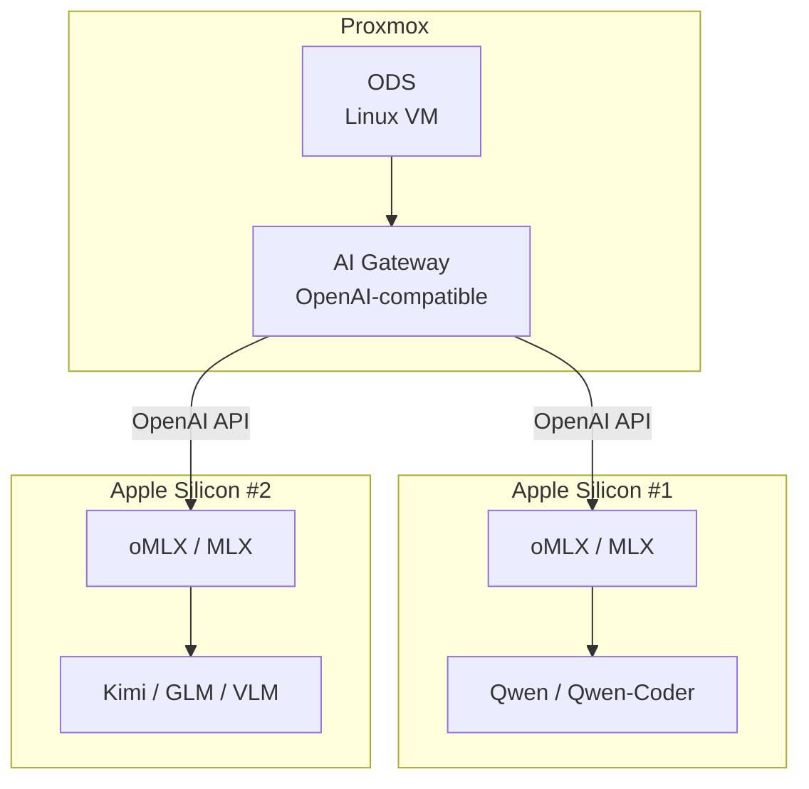
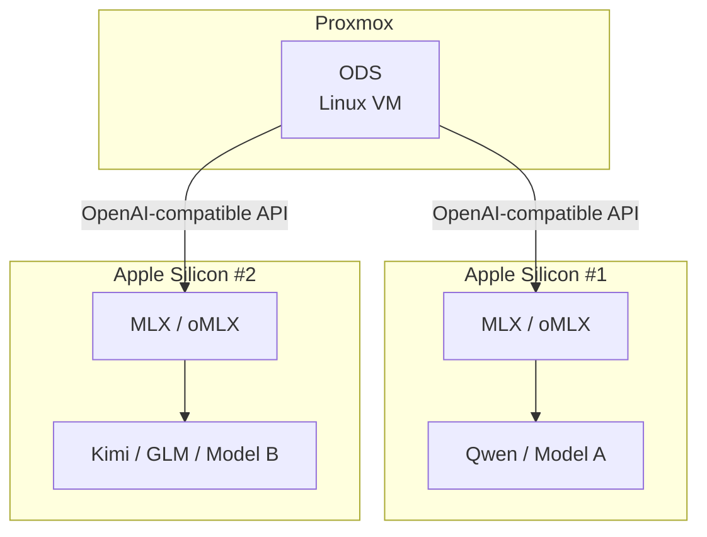
The Linux VM handles orchestration and application services:

- ODS
- Web UI
- Agents
- RAG
- Vector database
- Workflows
- Search
- Other AI services

The Apple Silicon machines handle model inference:

- MLX
- mlx-lm
- oMLX or another MLX-compatible inference server
- Qwen
- Kimi
- GLM
- Vision-language models where supported

This keeps model inference off the Proxmox VM and avoids installing ODS on the Apple Silicon machines.

## Recommended topology

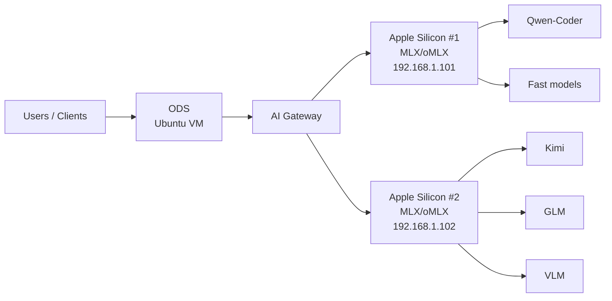

The gateway can route requests according to model capability.

Example routing:

```text
Coding request
    -> Qwen-Coder

Long reasoning
    -> Kimi

General reasoning
    -> GLM

Fast/simple request
    -> smaller Qwen

Vision request
    -> VLM-capable model
```

## Apple Silicon inference

Apple's open-source MLX framework is designed for Apple Silicon.

Repository:

https://github.com/ml-explore/mlx

MLX-LM provides LLM inference and model tooling:

https://github.com/ml-explore/mlx-lm

A basic MLX-LM installation is:

```bash
python3 -m venv ~/mlx
source ~/mlx/bin/activate

pip install mlx mlx-lm
```

A model can then be run directly with MLX-LM:

```bash
mlx_lm.chat \
    --model mlx-community/Qwen3-30B-A3B-4bit
```

For a remote ODS architecture, the important requirement is not the interactive CLI. The Mac needs to expose an HTTP inference API that the Proxmox ODS VM can reach.

## MLX server choices

### MLX-LM server

The simplest approach is to use the server capability provided by MLX-LM.

Conceptually:

```text
ODS
 |
 | OpenAI-compatible HTTP API
 v
mlx-lm server
 |
 v
MLX
 |
 v
LLM
```

### oMLX

oMLX is a more complete MLX inference-server option and is a strong candidate for this architecture.

Useful capabilities include:

- OpenAI-compatible API
- Anthropic-compatible API
- multiple models
- continuous batching
- VLM support
- embeddings
- reranking
- caching
- native Apple Silicon execution

Repository:

https://github.com/jundot/omlx

The exact project capabilities and command-line options should be checked against the current release before deployment.

## Proxmox Linux VM

Create a dedicated Ubuntu VM.

Suggested starting configuration:

```text
OS:        Ubuntu 24.04 LTS
CPU:       4-8 vCPU
RAM:       16-32 GB
Disk:      100-200 GB SSD
GPU:       Not required
Network:   High-speed LAN / management VLAN
```

The VM does not need access to a GPU because inference happens on the Apple Silicon machines.

Install Docker:

```bash
sudo apt update
sudo apt install -y ca-certificates curl git

curl -fsSL https://get.docker.com | sudo sh

sudo usermod -aG docker "$USER"
newgrp docker

docker version
```

Clone ODS:

```bash
git clone https://github.com/Osmantic/ODS.git

cd ODS/ods

git fetch --tags
git checkout v2.6.0
```

Check the current ODS documentation and release before production deployment:

https://github.com/Osmantic/ODS

## External LLM configuration

ODS supports using an external LLM instead of installing the model on the Linux machine.

For an external endpoint, configure ODS to point at the Apple Silicon inference server.

The exact installer flags should be confirmed against the current ODS release. The documented external-LLM workflow includes:

```bash
./install.sh --reuse-external-llm
```

or explicit external LLM configuration where supported by the release.

The resulting architecture is:

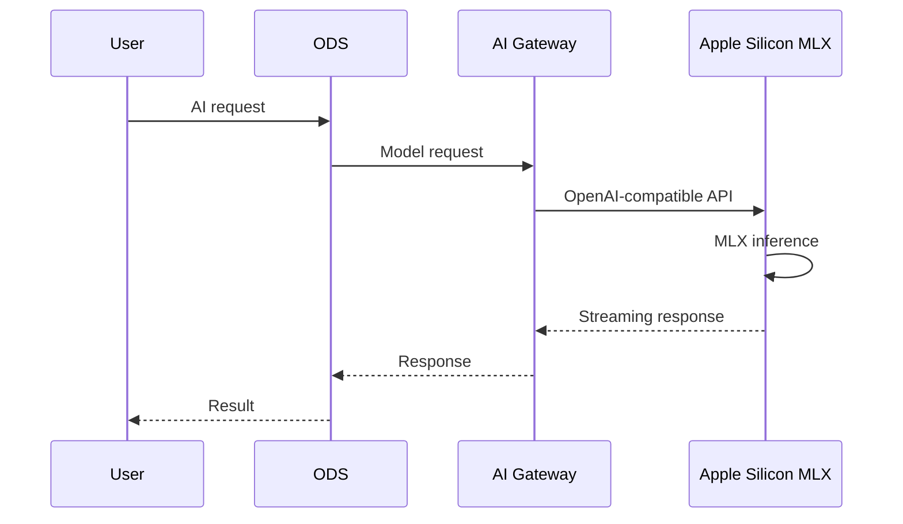

## Two Apple Silicon machines

Do not initially combine the machines into one distributed inference cluster.

Instead, run independent inference servers.

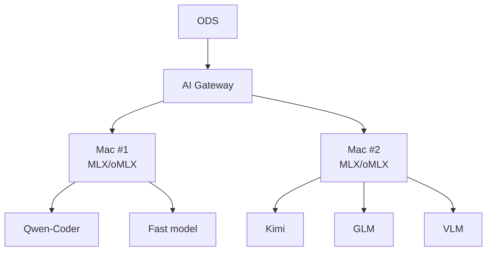

This is the preferred design because it allows:

1. Model specialization.
2. Load balancing.
3. Independent model upgrades.
4. Better utilization of both machines.
5. Isolation when one model or server is unavailable.
6. Different models to be loaded on each machine.
7. Independent scaling.

For example:

```text
Mac #1
    Qwen-Coder
    Fast Qwen

Mac #2
    Kimi
    GLM
    VLM
```

The gateway can then route requests according to the requested model or task.

## Load balancing

The gateway can distribute independent requests:

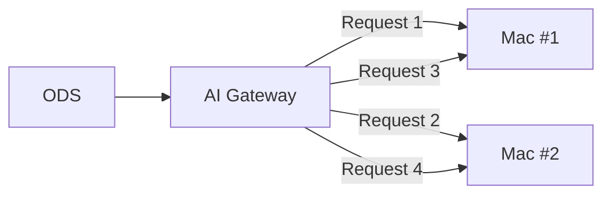

This is particularly useful when ODS has multiple simultaneous agents or users.

For example:

```text
Agent 1 -> Mac #1
Agent 2 -> Mac #2
Agent 3 -> Mac #1
Agent 4 -> Mac #2
```

## Distributed inference

MLX also supports distributed workloads across Apple Silicon systems.

That creates a different architecture:

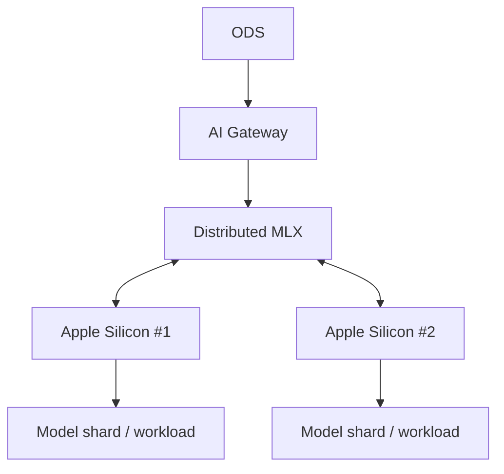

Distributed inference is useful when a model is too large or otherwise benefits from being distributed across machines.

However, two machines should not automatically be treated as one large memory pool.

Distributed inference introduces:

- network traffic
- synchronization
- communication latency
- additional configuration
- potential throughput penalties

Therefore, a model that fits comfortably on one Mac is generally better served by an independent inference server.

## Network requirements

Independent inference:

```text
Proxmox ODS
      |
      | 1/10 GbE
      |
      +------ Mac #1
      |
      +------ Mac #2
```

Distributed inference:

```text
Mac #1 <========== 10 GbE ==========> Mac #2
```

10 GbE is strongly preferred for distributed inference because the machines need to exchange data during inference.

For independent inference, 1 GbE can work, although 10 GbE is preferable for overall responsiveness and concurrent workloads.

## Network segmentation

A sensible design is to isolate the AI infrastructure.

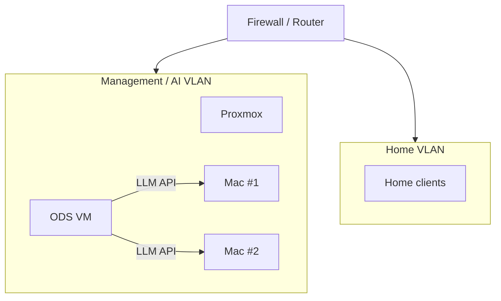

Firewall rules should allow only the required flows.

Example:

```text
ODS VM -> Mac #1 inference API
ODS VM -> Mac #2 inference API

Approved clients -> ODS Web UI

Internet -> X -> Apple Silicon inference APIs
Internet -> X -> internal ODS services unless explicitly required
```

Do not expose the LLM API directly to the Internet.

## Example IP layout

```text
Proxmox host       192.168.1.x
ODS VM             192.168.1.50
Mac Studio #1      192.168.1.101
Mac Studio #2      192.168.1.102
```

Example inference endpoints:

```text
Mac #1:
http://192.168.1.101:8080/v1

Mac #2:
http://192.168.1.102:8080/v1
```

Use the actual API path and port exposed by the selected MLX server.

## Security

The Apple Silicon inference servers should listen only on the required LAN interface or VLAN.

At minimum:

```text
Internet
   |
   X
   |
AI VLAN
   |
   +-- ODS
   |
   +-- Mac #1
   |
   +-- Mac #2
```

Use firewall rules to limit which hosts can access the inference ports.

If TLS/authentication is not provided by the inference server, keep the API on a trusted internal network and place an authenticated reverse proxy or gateway in front of it where appropriate.

## Why not Ollama or LM Studio?

Ollama and LM Studio are convenient, but neither is required.

The Apple Silicon stack can instead be:

```text
Apple Silicon
     |
     v
    MLX
     |
     v
  MLX-based
inference server
     |
     v
OpenAI-compatible API
```

This removes an additional abstraction layer and makes the architecture more explicitly Apple-Silicon-native.

LM Studio is also not fully open source, whereas MLX and MLX-LM are open source.

## Recommended final architecture

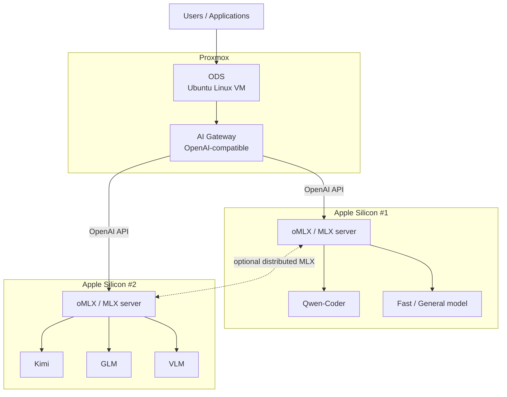

## Final design principles

The architecture should follow these rules:

```text
1. ODS runs only on Linux inside Proxmox.

2. Apple Silicon machines run inference only.

3. Use MLX as the Apple Silicon inference foundation.

4. Prefer oMLX or another MLX-native API server over LM Studio/Ollama
   when a fully open-source Apple Silicon stack is desired.

5. Start with independent inference servers on the two Macs.

6. Put an AI gateway in front of both inference servers.

7. Route coding, reasoning, VLM and fast workloads to appropriate models.

8. Use distributed MLX only when a model actually benefits from
   combining the two Apple Silicon machines.

9. Use 10 GbE for distributed inference.

10. Keep the inference APIs private to the internal AI network.

11. Do not install ODS on either Apple Silicon machine.
```

## Target architecture in one diagram

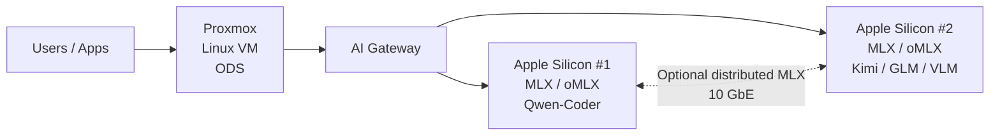

This design separates **orchestration from inference**: Proxmox provides the ODS platform, while the Apple Silicon machines provide dedicated high-performance LLM inference.

# MLX vs oMLX

ODS
 │
 │ OpenAI API
 ▼
Mac #1
oMLX coordinator
 │
 │ MLX distributed
 │
 ▼
Mac #2

| Capability                                  | **Apple MLX**                             | **oMLX**                                   |
| ------------------------------------------- | ----------------------------------------- | ------------------------------------------ |
| Open source                                 | Yes                                       | Yes, Apache 2.0                            |
| Apple Silicon native                        | **Yes**                                   | **Yes — built on MLX**                     |
| Single-Mac inference                        | **Excellent**                             | **Excellent**                              |
| OpenAI-compatible API                       | Via MLX-LM/server tooling                 | **Yes, built in**                          |
| Multi-model serving                         | Low-level/framework capability            | **Yes**                                    |
| Continuous batching                         | Primarily framework capability            | **Yes**                                    |
| Paged/persistent KV cache                   | Framework-level                           | **Yes**                                    |
| SSD KV cache                                | No core feature                           | **Yes**                                    |
| Run one model across 2 Macs                 | **Yes, at framework level**               | **Yes — dedicated cluster implementation** |
| Unequal RAM Macs                            | Possible, but you build the orchestration | **Supported by oMLX cluster**              |
| Automatic layer placement                   | You implement/use a higher-level tool     | **Yes**                                    |
| Memory-aware shard planning                 | Framework-level                           | **Yes**                                    |
| Pipeline parallelism                        | Supported through distributed primitives  | **Implemented for cluster inference**      |
| JACCL / Thunderbolt RDMA                    | **Yes**                                   | **Yes**                                    |
| TCP Ring                                    | **Yes**                                   | **Yes**                                    |
| KV cache remains local to shard             | Depends on implementation                 | **Yes**                                    |
| Cluster monitoring                          | No                                        | **Yes**                                    |
| Cluster API                                 | No high-level server                      | **Yes**                                    |
| Model-serving API                           | Build/use MLX-LM                          | **Yes**                                    |
| Best for building your own inference system | **Yes**                                   | No — higher-level                          |
| Best for "run huge model across two Macs"   | Good foundation                           | **Better choice**                          |
| Maturity of 2-Mac clustering                | Framework capability                      | **Experimental**                           |
| Recommended for your project                | Foundation                                | **My choice**                              |

MLX
 │
 ├── Metal
 ├── MLX distributed
 │     ├── Ring
 │     ├── JACCL
 │     └── MPI
 │
 └── MLX-LM

o MLX
 │
 ├── Metal
 ├── MLX distributed
 │     ├── Ring
 │     ├── JACCL
 │     └── MPI
 │
 └── MLX-LM

Mac Studio #1
256 GB
        │
        │ Layers 0–N
        │
        ▼
┌─────────────────────┐
│       MLX/oMLX      │
│                     │
│  Layers 0-60        │
│  KV cache           │
└──────────┬──────────┘
           │
           │ Thunderbolt / JACCL
           ▼
┌─────────────────────┐
│       MLX/oMLX      │
│                     │
│  Layers 61-120      │
│  KV cache           │
└─────────────────────┘
        │
Mac Studio #2
128 GB

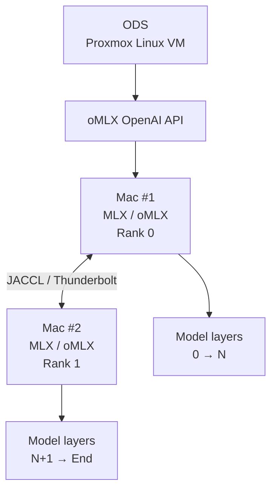

ODS
 │
 │ OpenAI API
 ▼
Mac #1
oMLX coordinator
 │
 │ MLX distributed
 │
 ▼
Mac #2
