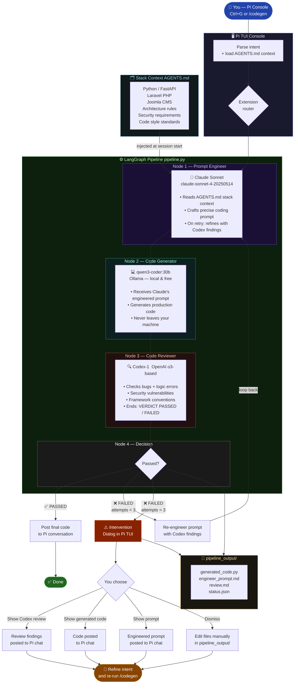

# Codegen Pipeline — Architecture Diagram



## Model Roles

| Stage | Model | Provider | Cost | Why |
|---|---|---|---|---|
| **Prompt Engineer** | claude-sonnet-4-20250514 | Anthropic API | ~$3/M tokens | Best meta-reasoning, understands mixed stacks |
| **Code Generator** | qwen3-coder:30b | Ollama — local | Free | Strong coding model, runs privately on your machine |
| **Code Reviewer** | codex-1 (o3-based) | OpenAI API | Premium | Specialist software engineering model, deep bug detection |

## Loop Behaviour

| Outcome | What happens |
|---|---|
| **PASSED** | Code posted directly into Pi conversation |
| **FAILED — attempt 1 or 2** | Claude re-engineers the prompt using Codex's specific findings |
| **FAILED — attempt 3** | Pi pauses and shows intervention dialog — you inspect and decide |

## Key Files

```
codegen-pipeline/
├── pipeline/pipeline.py          ← LangGraph pipeline (4 nodes)
├── pipeline/.env                 ← API keys + model config
├── pi-extension/codegen-pipeline.ts  ← Pi TUI integration
├── pi-skill/SKILL.md             ← natural language trigger
└── agents/AGENTS.md              ← your stack context (copy to project root)
```
