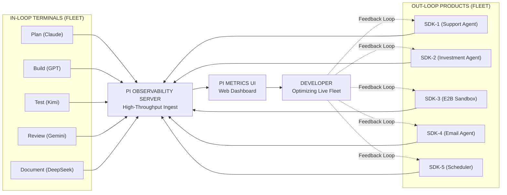
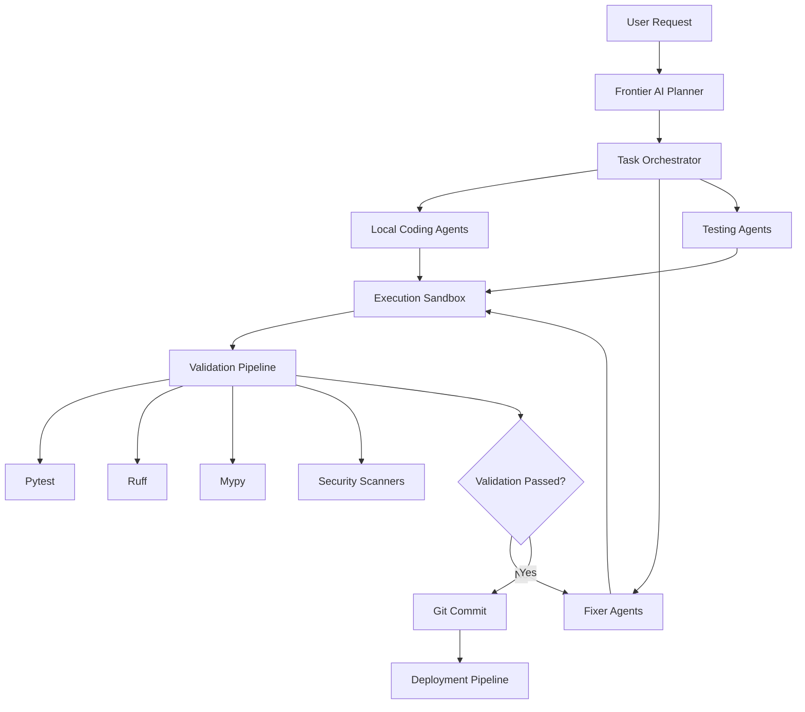
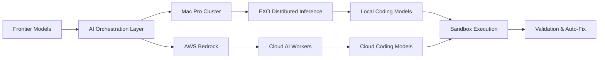
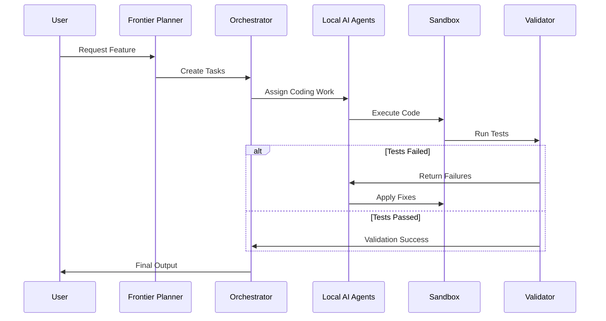
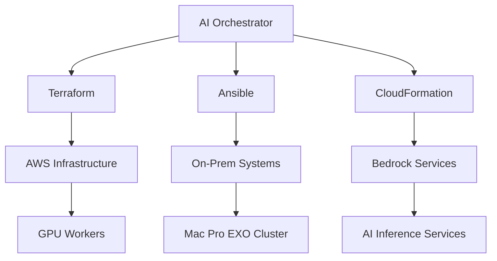

# Snapper AI
# Stratified AI Harnes (Hierarchical AI orchestration system)
Use Frontiner Models control local Dev LLMs

# Trade Offs and Constratings

- Cost is a issues.
- Time isn't a issue, within reason, there is no unlimited amoumt.
- Use all Frontiner models, we don't care or have any alliance to anyone, the only alliances is to outcome.
- Local is best, we understand that Giant copporatiuon are inheenly corrupt and do not serve hummanity, and will lose or exploire our data, what evern they EULA says or not. We do not trust someone else with iur thoughts data and IP.
- Comuter will contuine to follow mores law
- Algorthimgs will be faster and more efficnety due to human ingentoty, this will exponatilly increase and local LLM at the moment of writing is 1 year behind Frontiner models. 
- Building OnPrem is just as easy as Cloud, we are not a silly non-techncail CIO
- Frontiner models should be use to provide world view and review and prompt engoering only to local models that should do all the coding and IP of architecture.
- Frontiner models will steal your code and give it others.
- Future of AI is not monlicthc datacentres, its locally desicperted community derive compuete and process. 

- ChatGPT - https://chatgpt.com/c/6a005b43-cf3c-83ec-9d43-b5bee220d945
- LocalStack - https://chatgpt.com/c/6a0a91ec-03b4-83ec-ad9d-c1c2f25ec546
- BoM - https://docs.google.com/spreadsheets/d/1OPLUdApXABMNY3MzmxDUKfaY38fHsqDruKJtHmcvKog/edit?gid=662722876#gid=662722876

## Autonomous AI Coding Harness

Build software faster using hierarchical AI orchestration.

Our platform combines frontier AI models with local coding agents to create a scalable, cost-efficient autonomous software engineering system. High-reasoning models handle planning, architecture, and validation, while distributed local AI agents execute coding, testing, debugging, and automation tasks inside secure isolated environments.

Local AI execution can run across on-premise Mac Pro clusters using EXO, or scalable cloud-based AI infrastructure inside AWS using Bedrock, with fully automated Infrastructure-as-Code (IaC) provisioning and orchestration.

The result is an intelligent development harness that continuously generates, validates, fixes, deploys, and improves code with minimal human intervention

This reduces token usage and gaming by Frontiner models, while keeping your IP (the code) private within your walled garden.)

## MVP Constraints

- Use MacPro for Local
- Use AWS Bedrock for Large Local Models if required
- Use Proxmox and NUC to build the infrastructure
- Get the same system to self improve the project.
- Goal is to use Operating Systems, rather than do everything within a SaaS platform like https://app.all-hands.dev/

# Features

```mermaid
architecture-beta
    group harness["Harness"]

    service llm(server)[LLM]

    service tools(database)["3rd-Party Tools"] in harness
    service prompts(document)["System Prompts"] in harness
    service sandbox(server)["Code Sandbox"] in harness
    service rag(database)["RAG"] in harness
    service skills(tool)["Skills"] in harness
    service agents(server)["Sub-agents"] in harness
    service loop(control)["Loop Control"] in harness
    service context(database)["Context Loading"] in harness

    llm:R --> L:prompts
```





| Project                                                                              | Best For                            |
| ------------------------------------------------------------------------------------ | ----------------------------------- |
| [OpenHands GitHub](https://github.com/All-Hands-AI/OpenHands?utm_source=chatgpt.com) | Full autonomous coding harness      |
| [Aider](https://aider.chat?utm_source=chatgpt.com)                                   | Git-native coding assistant         |
| [Microsoft AutoGen](https://github.com/microsoft/autogen?utm_source=chatgpt.com)     | Multi-agent orchestration           |
| [Microsoft Agent Framework](https://github.com/microsoft/agent-framework)            | General autonomous agent platform   |
| [OpenDevin GitHub](https://github.com/OpenDevin/OpenDevin?utm_source=chatgpt.com)    | Earlier OpenHands codebase          |
| [Continue.dev](https://continue.dev?utm_source=chatgpt.com)                          | IDE-integrated local AI coding      |
| [Cline GitHub](https://github.com/cline/cline?utm_source=chatgpt.com)                | VSCode autonomous agent             |
| [OpenCode GitHub](https://github.com/opencode-ai/opencode?utm_source=chatgpt.com)    | Terminal-native coding agents       |
| [SWE-agent GitHub](https://github.com/SWE-agent/SWE-agent?utm_source=chatgpt.com)    | Benchmark-focused autonomous fixing |
| [OpenClaw GitHub](https://github.com/openclaw/openclaw?utm_source=chatgpt.com)       | General autonomous agent platform   |
| [Terax-AI](https://github.com/crynta/terax-ai)                                       | General autonomous agent platform   |
| [DeepSeek UI](https://github.com/Hmbown/DeepSeek-TUI)                                | DeepSeek                            |
| [Hermes Agent](https://hermes-agent.nousresearch.com/)                                | Hermes                              |
| [PA AI](https://github.com/danielmiessler/Personal_AI_Infrastructure)                 | PA AI                               |
| https://www.bridgemind.ai/             |                            |
| https://pi.dev/            |                            |
| https://www.bridgemind.ai/             |                            |
| Odysseus(https://github.com/pewdiepie-archdaemon/odysseus
https://msty.ai/claw
https://diffusionbee.com/

# ARCHITECTURE
| MODEL               | HARNESS | DATA    |
|---------------------|----------|------|
| Frontier            |          |      |
| Local Mac Cluster   |          |      |
| Local GPU Cluster   |          |      |
| Local AWS Cluster   |          |      |

# AI MiniRack

- Project MiniRack - https://mini-rack.jeffgeerling.com/
- Single Board Cluster - https://sbcc.sdsc.edu/main-page.html
- Top500 Benchmark - HPL Linpack -
- MINISFORUM MS-S1 Max

# Loal AI Benchmark

- https://artificialanalysis.ai/agents/coding-agents
  
# Test Prompts

```md
enerate a single, self-contained HTML file that renders an animated lava lamp. Requirements:

All HTML, CSS, and JavaScript inline in one file — no external assets, no CDNs.
A lamp silhouette (base, neck, glass bulb, cap) with smooth, glowing colors.
6–10 metaball-style blobs inside the glass that slowly rise, fall, merge, and split, with realistic squishy deformation when they touch (use SVG filters with feGaussianBlur + feColorMatrix to threshold alpha, or a Canvas/WebGL metaball shader — your choice).
Warm gradient lighting from the bulb at the base; subtle glow around the glass; dark background.
60fps target, no jank, looks good full-screen.
No controls, no text — just the lamp.

Output only the HTML file contents, nothing else.
```

# Stack


- Compute
-     Omrach/W11 SOE
-     Guacamole / NX Server / TailScale
- Memmory
-     Wiki
-     Read the Docs

- Automation
-     Worklenz
-     Obsidian
-     JupiterNotebook
-     N8n
-     OpenRouter, Open Chat, SG Lang and vLLM
- Code Repo
-     GitLabh ttps://forgejo.org/
-     https://github.com/makeplane/plane
-     Huly
- Platform
-     S3
-     https://www.openproject.org/
-     Proxmox
-     LocalStack - https://chatgpt.com/c/6a0a91ec-03b4-83ec-ad9d-c1c2f25ec546
-     https://www.opendevstack.org/
- Code Quality
-     SonarCube
- Testing
-     Playwright
- Hosting
-     CPANEL
-     LAMP/NGNIX/Joomla


# Autonomous AI Coding Harness

Build software faster using hierarchical AI orchestration.

Our platform combines frontier AI models with local coding agents to create a scalable, cost-efficient autonomous software engineering system. High-reasoning models handle planning, architecture, and validation, while distributed local AI agents execute coding, testing, debugging, and automation tasks inside secure isolated environments.

Local AI execution can run across on-premise Mac Pro clusters using EXO, or scalable cloud-based AI infrastructure inside AWS using Bedrock, with fully automated Infrastructure-as-Code (IaC) provisioning and orchestration.

The result is an intelligent development harness that continuously generates, validates, fixes, deploys, and improves code with minimal human intervention.

---

# Core Capabilities

- Hierarchical AI orchestration
- Frontier model planning and reasoning
- Local AI execution agents
- Autonomous debugging and remediation
- Continuous validation loops
- Infrastructure-as-Code automation
- Git-native workflows
- Docker and VM sandbox execution
- Distributed AI inference clusters
- Automated deployment pipelines
- Multi-agent software engineering
- Secure isolated execution environments

---

# Platform Architecture



---

# Hybrid AI Infrastructure



---

# Autonomous Development Loop



---

# Infrastructure-as-Code Automation



---

# Recommended Technology Stack

| Layer | Technology |
|---|---|
| Orchestration | Python + asyncio |
| Local AI Runtime | Ollama |
| Distributed Inference | EXO |
| Cloud AI | AWS Bedrock |
| Validation | Pytest + Ruff + Mypy |
| Sandbox | Docker |
| Infrastructure | Terraform |
| Source Control | Git |
| API Layer | FastAPI |
| Memory Layer | SQLite + Vector DB |
| Queue System | Redis |

---

# Example Workflow

```text
User Request
    ↓
Frontier AI Planning
    ↓
Task Decomposition
    ↓
Distributed Local AI Execution
    ↓
Docker Sandbox Testing
    ↓
Validation & Security Checks
    ↓
Autonomous Fix Loop
    ↓
Git Commit & Deployment
```

---

# Vision

The future of software engineering is a coordinated system of intelligent AI agents that plan, execute, validate, repair, deploy, and continuously improve software autonomously across local and cloud infrastructure.


## Research 
- https://github.com/cancerit/CaVEMan
- Terminal

# AI-DLC (AI-Driven Development Life Cycle)

- AI-DLC (AI-Driven Development Life Cycle) - https://github.com/awslabs/aidlc-workflows
- AI-DLC Governance Orchestrator - https://github.com/kdeath83/ai-dlc-governance-orchestrator
- AI-DLC Governance Orchestrator - https://kdeath83.github.io/ai-dlc-governance-orchestrator/dashboard/
- AI-Driven Development Lifecycle for Financial Services - https://aws.amazon.com/blogs/industries/ai-driven-development-lifecycle-for-financial-services/
- https://github.com/awslabs/aidlc-workflows


- https://www.linkedin.com/posts/krish-de-97b9751a_six-aws-engineers-rebuilt-the-amazon-bedrock-share-7467010049576542210-Sp0z/?utm_source=share&utm_medium=member_desktop&rcm=ACoAAADYqlEBFhWq_nhEp3BtPb1m0UqSgw4MxKI
