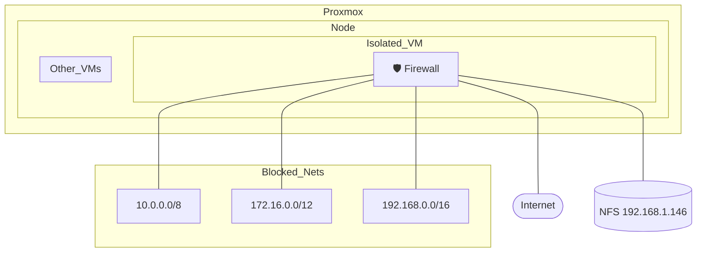

# Proxmox Internet-Only VM/LXC Firewall Guide

```mermaid
graph TD
    subgraph Proxmox
        subgraph Node
            subgraph Isolated_VM
                fw[🛡 Firewall]
            end
            subgraph Other_VMs
            end
        end
    end

    subgraph Blocked_Nets
        net10[10.0.0.0/8]
        net172[172.16.0.0/12]
        net192[192.168.0.0/16]
    end

    internet([Internet])
    nfs[(NFS 192.168.1.146)]

    fw --- internet
    fw --- nfs
    fw --- net10
    fw --- net172
    fw --- net192
```
