# Build better Prezi

## yowza avaibikity 

- https://reactbits.dev/
- https://www.remotion.dev/
- https://animejs.com/
- Three.JS
- Reveal.js
- GSAP -https://gsap.com/docs/v3/Installation/guides/Club%20GSAP%20&%20Vercel/
- https://r3f.docs.pmnd.rs/getting-started/introduction
- You can use AI to build awesome slides - https://r3f-3d-slideshow.vercel.app/
- https://r3f-animated-book-slider-final.vercel.app/
- PaceUI - https://next.jqueryscript.net/next-js/animated-components-gsap-paceui/
- https://docling-project.github.io/docling/
- https://www.youtube.com/watch?v=edUOvt6Y5ts
- https://tldraw.dev/starter-kits/shader
- https://github.com/heygen-com/hyperframes

## JavaScript Libaraies 

- https://gsap.com/showcase/
- https://canvasui.dev/

## Process
- Review this presetnation and extract the key components, Background foreground, animation bits, transitions. etc - https://www.youtube.com/watch?v=3Y1G9najGiI

### Features

- Audience Particpatation and engagment -
- Vertical Scroll, Horizontal call, information for powerpoint replacement , copy a powerpoint and convert to HTML, etc
- show.io
- https://prezi.com/
- Import from Import your slides from Github Markup format
- https://sli.dev/
- https://sli.dev/guide/why
- https://slides.com/features
- https://splidejs.com/
- Live Events are stupid, Q&A Ongoing using Forums, Video and Audio playback recording using AI speach.
- https://github.com/wass08/r3f-animated-book-slider-final
- Pay for Private Profile, video recording, audiance analytics, access audiance attendance.
- Choose from Interactive Backgrounds - https://www.sliderrevolution.com/resources/three-js-examples/, or submit your own via git
- https://github.com/jeertmans/manim-slides-starter?tab=readme-ov-file
- Slides but with a community to interact, chat and surevey and socilise.
- Make a prezi animation , import cvs to animate the words simple animations using three.js with interaction and chat questions on the sides , like twich. just for presentations no video, text/youtube for text. You can pay for video recording, etc.
- Follow Preseation/Communcation Metoldoogy - like the one i have in that folder. 

## Templates

- Play NextJS - https://github.com/NextJSTemplates/play-nextjs?utm_source=chatgpt.com
- Next.js & shadcn/ui Admin Dashboard - https://vercel.com/new/templates/next.js/next-js-and-shadcn-ui-admin-dashboard
### ChatGPT

- https://chatgpt.com/c/689c1f63-72a8-832c-9f1c-834b38d8ea24
- https://chatgpt.com/c/688282c4-a99c-800e-9ec0-b018de03dc78
- https://dash.cloudflare.com/cde2b83e96bce23a8db072465a882cc5/workers-and-pages/create/deploy-to-workers?repository=https%3A%2F%2Fgithub.com%2Fcloudflare%2Fvibesdk
- https://build.cloudflare.dev/app/89993bf4-4421-446b-9091-8ef181acfa25
- https://prezi.com/p/rh_mfyroznft/understanding-prezi/?present=1
- https://github.com/Rohan749/text-animations/tree/folding-text

Presentations

Prezi is 2D, my version is moving back and forth in a 3D Space with Objects and placing content in 3D space as well as Dynamic Animation Motion Graphics.
Transitions between slides 2d Space 3d scroll based 3d space based Dymanic 3d Space and Particles. Scroll video effect

```mermaid
flowchart TD
    START["7 POWERFUL<br/>STORYTELLING FRAMEWORKS"]

    START --> F1
    START --> F2
    START --> F3
    START --> F4
    START --> F5
    START --> F6
    START --> F7

    %% 1 Freytag's Pyramid
    subgraph F1["1. FREYTAG'S PYRAMID"]
        direction LR
        F1A["Exposition"] --> F1B["Rising Action"]
        F1B --> F1C["Climax"]
        F1C --> F1D["Falling Action"]
        F1D --> F1E["Resolution"]
    end

    %% 2 Dan Harmon's Story Circle
    subgraph F2["2. DAN HARMON'S STORY CIRCLE"]
        direction LR
        F2A["1. You<br/>A Character"]
        F2B["2. Need<br/>Want Something"]
        F2C["3. Go<br/>Enter Unfamiliar Situation"]
        F2D["4. Search<br/>Adapt to New World"]
        F2E["5. Find<br/>Get What They Wanted"]
        F2F["6. Take<br/>Pay a Heavy Price"]
        F2G["7. Return<br/>Go Back to Familiar Situation"]
        F2H["8. Change<br/>Having Changed"]

        F2A --> F2B --> F2C --> F2D
        F2D --> F2E --> F2F --> F2G --> F2H --> F2A
    end

    %% 3 Hero's Journey
    subgraph F3["3. THE HERO'S JOURNEY"]
        direction LR
        F3A["Ordinary World"]
        F3B["Call to Adventure"]
        F3C["Crossing the Threshold"]
        F3D["Tests"]
        F3E["Allies & Enemies"]
        F3F["The Ordeal"]
        F3G["The Reward"]
        F3H["Return with Elixir"]

        F3A --> F3B --> F3C --> F3D
        F3D --> F3E --> F3F --> F3G --> F3H
    end

    %% 4 Fichtean Curve
    subgraph F4["4. FICHTEAN CURVE"]
        direction LR
        F4A["Rising Action"]
        F4B["Crisis 1"]
        F4C["Crisis 2"]
        F4D["Crisis 3"]
        F4E["Climax"]
        F4F["Resolution"]

        F4A --> F4B --> F4C --> F4D --> F4E --> F4F
    end

    %% 5 Three Act Structure
    subgraph F5["5. THREE-ACT STRUCTURE"]
        direction LR
        F5A["ACT I<br/>SETUP<br/>Inciting Incident<br/>Plot Point 1"]
        F5B["ACT II<br/>CONFRONTATION<br/>Midpoint<br/>Plot Point 2"]
        F5C["ACT III<br/>RESOLUTION<br/>Climax<br/>New Equilibrium"]

        F5A --> F5B --> F5C
    end

    %% 6 Save the Cat
    subgraph F6["6. SAVE THE CAT BEAT SHEET"]
        direction LR
        F6A["Opening Image"]
        F6B["Theme Stated"]
        F6C["Set-Up"]
        F6D["Catalyst"]
        F6E["Debate"]
        F6F["Break into Two"]
        F6G["B Story"]
        F6H["Fun & Games"]
        F6I["Midpoint"]
        F6J["Bad Guys Close In"]
        F6K["All Is Lost"]
        F6L["Dark Night of the Soul"]
        F6M["Break into Three"]
        F6N["Finale"]
        F6O["Final Image"]

        F6A --> F6B --> F6C --> F6D --> F6E
        F6E --> F6F --> F6G --> F6H --> F6I
        F6I --> F6J --> F6K --> F6L --> F6M
        F6M --> F6N --> F6O
    end

    %% 7 Seven Point Story Structure
    subgraph F7["7. SEVEN-POINT STORY STRUCTURE"]
        direction LR
        F7A["1. Hook"]
        F7B["2. Plot Turn 1"]
        F7C["3. Pinch Point 1"]
        F7D["4. Midpoint"]
        F7E["5. Pinch Point 2"]
        F7F["6. Plot Turn 2"]
        F7G["7. Resolution"]

        F7A --> F7B --> F7C --> F7D
        F7D --> F7E --> F7F --> F7G
    end

    %% Styling
    classDef title fill:#172033,color:#ffffff,stroke:#172033,stroke-width:3px;
    classDef framework fill:#f5ead8,color:#172033,stroke:#8b7355,stroke-width:2px;
    classDef step fill:#ffffff,color:#172033,stroke:#777777,stroke-width:1px;

    class START title;
    class F1,F2,F3,F4,F5,F6,F7 framework;
    class F1A,F1B,F1C,F1D,F1E step;
    class F2A,F2B,F2C,F2D,F2E,F2F,F2G,F2H step;
    class F3A,F3B,F3C,F3D,F3E,F3F,F3G,F3H step;
    class F4A,F4B,F4C,F4D,F4E,F4F step;
    class F5A,F5B,F5C step;
    class F6A,F6B,F6C,F6D,F6E,F6F,F6G,F6H,F6I,F6J,F6K,F6L,F6M,F6N,F6O step;
    class F7A,F7B,F7C,F7D,F7E,F7F,F7G step;
```

